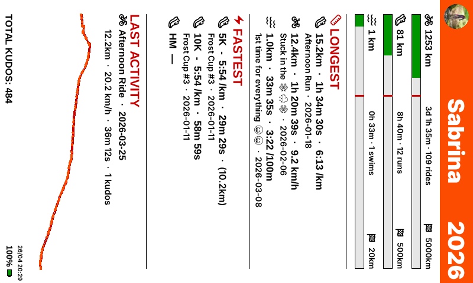
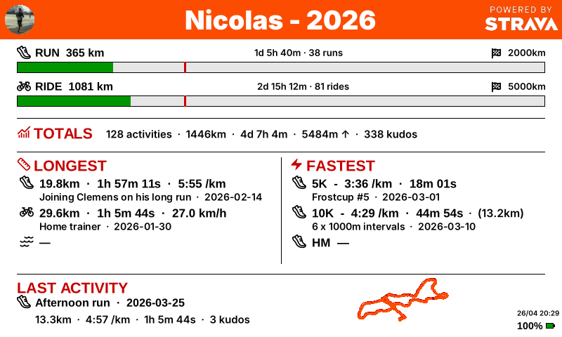

# Gallery

A few real-world configurations and the dashboard they produce. Each
example only shows the `[display]` (and `[[display.goals]]`) section --
you'll always need a `[strava]` section of your own (see
[Strava Authorization](./strava-auth.md)).

The full commented config lives at `dist/config.example.toml` in the repo.

## Sabrina -- landscape

Three goals (ride, run, swim), no totals row to free up vertical space,
with `longest_by = "time"` for the ride.


```toml
[display]
show_totals = false
show_longest_fastest = true
polyline_thickness = 4
orientation = "landscape"

[[display.goals]]
sport = "ride"
km = 5000.0
longest_by = "time"

[[display.goals]]
sport = "run"
km = 500.0

[[display.goals]]
sport = "swim"
km = 20.0
```

## Sabrina -- portrait

Same goals, rotated 90 degrees -- handy when the panel is mounted
vertically. All three progress bars stack instead of sharing a row.



```toml
[display]
show_totals = false
show_longest_fastest = true
polyline_thickness = 4
orientation = "portrait"

[[display.goals]]
sport = "ride"
km = 5000.0
longest_by = "time"

[[display.goals]]
sport = "run"
km = 500.0

[[display.goals]]
sport = "swim"
km = 20.0
```

## Nicolas -- landscape, run + ride

Two goals only (run is the priority -- full-width top bar) with the
TOTALS row enabled so the activity count, total distance, time, elevation
and kudos all show up.



```toml
[display]
show_totals = true
show_longest_fastest = true
polyline_thickness = 4
orientation = "landscape"

[[display.goals]]
sport = "run"
km = 2000.0

[[display.goals]]
sport = "ride"
km = 5000.0
longest_by = "time"
```
