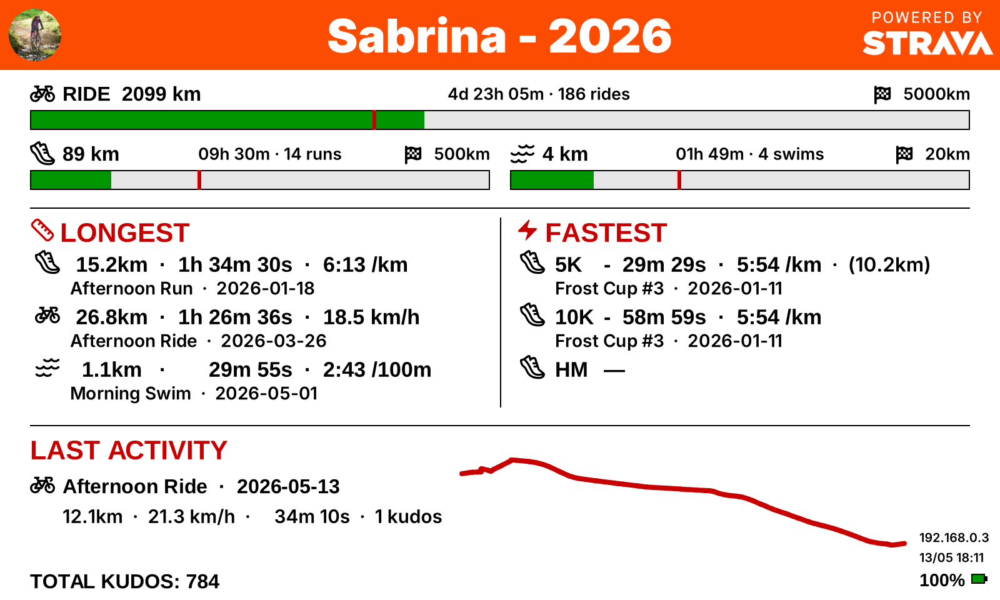

# Strava E-Paper Dashboard

This project turns a
[Waveshare Raspberry Pi Zero 2W PhotoPainter](https://www.waveshare.com/wiki/RPi_Zero_PhotoPainter)
into a Strava dashboard. It pulls activity data from Strava and renders a
configurable dashboard onto the 6-colors e-paper screen.



## Features

- Yearly distance goals per sport (run, ride, swim) with progress bars
- Year-to-date totals per sport (distance, time, elevation)
- Longest and fastest activity of the year per sport
- Race bests (5K, 10K, half marathon) with estimated paces
- Last activity summary plus the route polyline
- Sport icons for run, mountain bike, ride, swim, weight training, yoga,
  pilates, and a generic workout icon for anything else
- Battery indicator (when an INA219 sensor is wired up)
- Power management: configurable refresh interval, quiet hours, and
  optional shutdown between cycles for battery operation
- Kiosk mode for live previewing on a regular screen (no e-paper required)

## Install

The recommended way to install on the target machine is:

```bash
cargo install --git https://github.com/nobriot/rpi-zero2w-strava-dashboard
```

This installs the `strava-dashboard` binary into `~/.cargo/bin/`. Make sure
that directory is on your `PATH`.

For development from a clone:

```bash
git clone https://github.com/nobriot/rpi-zero2w-strava-dashboard
cd rpi-zero2w-strava-dashboard
cargo build --release
```

## Quick start

1. [Create a Strava API app](./strava-app.md) to obtain a Client ID and
   Client Secret.
2. Run the [auth flow](./strava-auth.md) once to produce a config file
   with a refresh token.
3. Tweak the generated config file (yearly goals, refresh interval,
   quiet hours, ...) -- a fully commented example lives at
   `dist/config.example.toml` in the repo.
4. Run the dashboard -- see [Usage](./usage.md).
5. Set it up as a systemd service so it starts on boot --
   see [Running as a Service](./service.md).

For development setups and cross-compiling to the Pi, see
[Building](./building.md). When something doesn't work,
[Troubleshooting](./troubleshooting.md) covers the most common issues.
