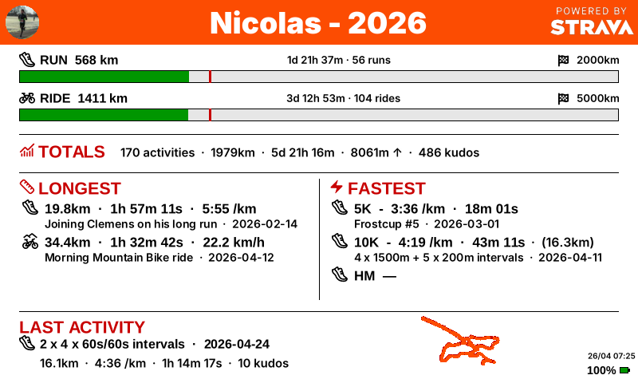

# Strava E-Paper Dashboard

This project turns a
[Waveshare Raspberry Pi Zero 2W PhotoPainter](https://www.waveshare.com/wiki/RPi_Zero_PhotoPainter)
into Strava dashboard. It pulls your data from Strava using the API and displays a configurable
dashboard on the 6-colors e-paper screen.

## What it shows

- **Yearly goal progress bars** for running, cycling, and swimming
- **Year-to-date totals** per sport (distance, time, elevation)
- **Longest and fastest activities** of the year
- **Race bests** (5K, 10K, half marathon)
- **Last activity** with a map of the route
- **Battery level**
- **Overall totals** (activity count, distance, elevation, kudos)

## How it works

The dashboard runs a simple loop:

1. Connect to the Strava API
2. Fetch your latest activities and stats
3. Render a dashboard image
4. Send the image to the e-paper display
5. Sleep for a few hours (configurable)
6. Repeat

The e-paper display keeps showing the last image even when powered off, so
your stats are always visible. Data is cached locally, so if WiFi is
temporarily unavailable, the dashboard shows the most recent data it has.

## Overview of the setup process

1. **Buy the hardware** (a PhotoPainter kit using RPi, and optionally a TPL5110)
2. **Prepare the Raspberry Pi** --- flash the SD card and configure WiFi
3. **Create a Strava API app** and **authorize it** on your computer --- this
   produces a config file with your credentials and refresh token
4. **Customize the configuration** --- set your sport goals, refresh interval, etc.
5. **Build and deploy** --- compile the software and copy it (along with the
   config) to the Pi
6. **Set it up as a service** so it starts automatically on boot

Each step is covered in detail in the following chapters.
